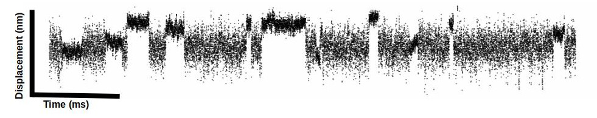
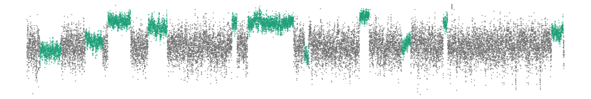

```{r, eval = FALSE, echo = FALSE}
library(xaringan)
options(browser = "firefox")
inf_mr("slides.Rmd")
```
<style>

.center2 {
  margin: 0;
  position: absolute;
  top: 50%;
  left: 50%;
  -ms-transform: translate(-50%, -50%);
  transform: translate(-50%, -50%);
}

</style>

---
# It's all in the muscle
.pull-left[
 
]

.pull-right[

]
---

# How do we understand how muscle works?
- Lots of cool experiments!

---

# Whole muscle *in vivo*
- Dynamometer

.center[

]

---

# Whole muscle *in vivo*
- Magnetic Resonance Spectroscopy

.center[

]
---
# Muscle Fiber Function (Single Fiber Force Rig)

- cellular level (human/animal biopsy)

.center2[

]

---
# The and/or...
--

### "The number and/or stiffness of the strongly bound myosin-actin cross bridges..."

--

.center[]


---
# Single molecule laser trapping! 


---


---


---
.pull-left[
<h3 style = "text-align: center; margin-top: 100px"> Use a Single Molecule Laser Trap... </h3>

]
.pull-right[

<h4 style = "text-align: center">Flowcell</h4>
]
---
.pull-left[
<h3 style = "text-align: center; margin-top: 100px"> Use a Single Molecule Laser Trap... </h3>
 
<br>
</h3>
]
.pull-right[
<h4 style = "text-align: center;  margin-top: 100px; color: white">Trapping Beads</h4>
<div  style = "width: 400px; margin: 0 auto; text-align: center">
<video>
  <source src="images/trapping-beads.mp4" type="video/mp4"> 
 </video>
</div>
]

---
.pull-left[
<h3 style = "text-align: center; margin-top: 100px"> Use a Single Molecule Laser Trap... </h3>

]
.pull-right[
<h4 style = "text-align: center;  margin-top: 170px; color: black">Brightfield & Fluorescent Fields</h4>
<div  style = "width: 400px; margin: 0 auto; text-align: center">

]
---
.pull-left[
<h3 style = "text-align: center; margin-top: 100px"> Use a Single Molecule Laser Trap... </h3>

]

.pull-right[
<h3 style = "text-align: center; margin-top: 100px"> To observe single molecule interactions </h3>

]
---

class: middle
# Data is a time series


---

<h1 style = "padding-bottom: 0px"> Analysis - Calculating Displacement Distributions </h1>
<div style = "float: right; width: 55%;padding-top: 150px"">
 
</div>

<div style = "float: left; width: 45%; padding-top: 50px">

</div> 
---
<h1 style = "padding-bottom: 0px"> Analysis - Calculating Displacement Distributions </h1>
<div style = "float: right; width: 55%;padding-top: 150px"">
<video muted preload="auto" width="1000" height="145" style = "padding-top: 0px"> 
 <source src="images/analyzed-trace.mp4" type="video/mp4">
  Your browser does not support the video tag. 
</video>
</div>
<div style = "float: left; width: 45%; padding-top: 50px">
<video autoplay muted preload="auto" width="1000" >
 <source src="images/dotplot.mp4" type="video/mp4">
  Your browser does not support the video tag. 
</video>
</div> 


---

# Calculate the force of a single cross-bridge


---

# Building a solid<sup>*</sup> foundation of molecular force production

- From the single molecule up &rarr; several molecule &rarr; cell level &rarr; whole organ


---

.pull-left[

## Pros
- only actin + myosin 

]

--

.pull-right[

## Cons
- only actin + myosin

]

---
But, the thin-filament shown to have mixed effects...

--

#### Single-myosin crossbridge interactions with actin filaments regulated by troponin-tropomyosin
- 50% less force with thin-filament in the laser trap

--

#### The molecular basis of thin filament activation: from single molecule to muscle
- Decreased attachment rate at pCa 4 compared to unregulated

--

#### Acidosis decreases the Ca2+ sensitivity of thin filaments by preventing the first actomyosin interaction
- Attachment rate is the same

--

#### Regulatory Proteins Alter Nucleotide Binding to Acto-Myosin of Sliding Filaments in Motility Assays
- Unregulated motility is slower than with regulated thin filaments (suggest Tn/Tm changes myosin kinetics). 

--

#### Cryo-EM and molecular docking shows myosin loop 4 contacts actin and tropomyosin on thin filaments

--

#### Load-dependent modulation of non-muscle myosin-2A function by tropomyosin 4.2

--

#### Tropomyosin is essential for processive movement of a class V myosin from budding yeast
---

# Myosin's force unchanged by thin filament


---
# Ensemble averaging reveals underlying mechanics
- Myosin has 2 powerstrokes
    1. Occurs rapidly upon actin binding
    2. Associated w/ ADP release
- Not evident in single events


---

# How to...


---
# How to...
##.center[Ensemble Average]


---
# Ensemble Average
<video muted preload="auto" width="100% " style = "padding-top: 0px; outline: none;">
 <source src="images/how-to-ee.mp4" type="video/mp4"> 
  Your browser does not support the video tag. 
</video>

---

# Ensemble Average

<div style = "width: 15%; padding-top: 50px; padding-left: 125px; float: left;">
 
</div>

<div style = "width: 50%; padding-top: 50px; padding-left: 125px; float: right;">
<video>
 <source src="images/ee2.mp4" type="video/mp4">
  Your browser does not support the video tag. 
</video>
</div>
---

# Thin-filament does not change myosin's mechanics


.pull-left.center[Unregulated]
.pull-right.center[Regulated]


---
# Myosin's attachment time prolonged by thin filament 

- at low [ATP] (1 &micro;M)


--

<h3 style = "text-align: center;">Why?</h3>

---
# Stopped Flow Kinetics
- Rate of ADP-release is unchanged by thin-filament


---

# Stopped Flow Kinetics
- Rate of ATP binding is slowed
- ATP binding occurs in several steps:


---
# Myosin's kinetics are load dependent


---
# Myosin's kinetics are load dependent

- Currently finishing collecting 
- Preliminary data suggest similiar load dependences between unreg/reg


---


