class: left, inverse
<h2 style = "margin-bottom: 10px; font-size: 31pt"> Myosin's powerstroke occurs prior to the release of phosphate from the active site </h2>
<h4 style = "margin-top:margin-bottom: 120px"> Brent Scott | Christopher Marang | Mike Woodward | Edward P. Debold </h4>
<h5 style = "margin-top: 0px">
Muscle Biophysics Lab, Department of Kinesiology,  University of Massachusetts, Amherst, Massachusetts, USA<sup>1</sup>
<br>
</h5>

<br>
<br>
<h3 style = "margin-top: 0px; padding-top: 0px"> Presented by: Brent Scott, MS, CSCS
<br>

```{r setup, include=FALSE}
library(tidyverse)
options(htmltools.dir.version = TRUE)
```

---
# How is Myosin's Force Production Coupled to Energetics?
<div style = "display: flex">
<div style ="width: 49%; float: left;">
<h4 style = "margin-bottom: 0px; padding-left: 150px">Myosin II</h4>
<br>

</div>
<div style ="width: 25%, float: right;">
<h4 style = "margin-bottom: 0px; padding-left: 350px">Myosin V</h4>
<br>

</div>
</div>
.footnote[Vale & Milligan 2000; David Warshaw Lab Website]

???
A fundamental question to biology/biophysics is in understanding how molecular motors like myosin couple force generation and biochemistry, however  the  molecular  basis  of  this  process  remains unclear. 
---
class: center, middle
# Myosin's Cross-Bridge Cycle
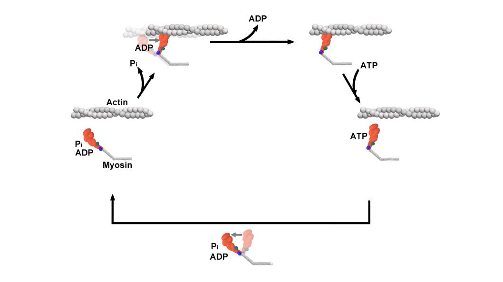

???
At the core of force production is the mechanochemical system that is myosin's cross bridge cycle. Here is a basic model...When myosin binds actin it shows myosin going through the powerstroke and releasing Pi in one step and then releasing ADP and binding a new ATP
---
class: center, middle
# Myosin's Cross-Bridge Cycle
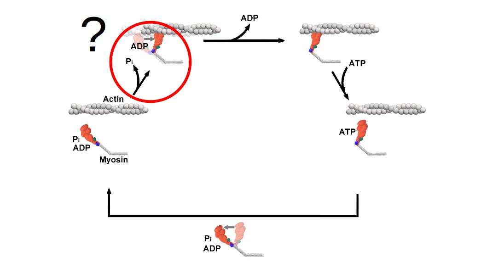
???
However, the timing or sequence of the powerstroke and pi release is unclear - a classic chicken and the egg conundrum
---
# Two Scenarios
.left-column[
<h3 style="color:black"> 1) Powerstroke occurs before P<sub>i</sub>-release </h3>
.footnote[Dantzig 1992; He 1997; Sleep 2005; Muretta 2015; Trivedi 2015; Woody 2019; Gunther 2020]
]

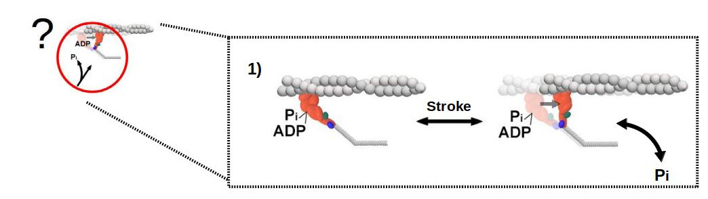
<div style = "padding-left: 300px">
</div>
---
# Two Scenarios
.left-column[
<h3 style="color:black"> 1) Powerstroke occurs before P<sub>i</sub>-release </h3>
.footnote[Dantzig 1992; He 1997; Sleep 2005; Muretta 2015; Trivedi 2015; Woody 2019; Gunther 2020]
]


<div style = "padding-left: 300px">
<li> Muscle fibers develop force faster than appearance of Pi in solution</li>
</div>
---
# Two Scenarios
.left-column[
<h3 style="color:black"> 1) Powerstroke occurs before P<sub>i</sub>-release </h3>
.footnote[Dantzig 1992; He 1997; Sleep 2005; Muretta 2015; Trivedi 2015; Woody 2019; Gunther 2020]
]


<div style = "padding-left: 300px">
<li> Muscle fibers develop force faster than appearance of Pi in solution</li>
<li> Release of caged P<sub>i</sub> causes delayed depression in isometric tension of fibers</li>
</div>

---
# Two Scenarios
.left-column[
<h3 style="color:black"> 1) Powerstroke occurs before P<sub>i</sub>-release </h3>
.footnote[Dantzig 1992; He 1997; Sleep 2005; Muretta 2015; Trivedi 2015; Woody 2019; Gunther 2020]
]


<div style = "padding-left: 300px">
<li> Muscle fibers develop force faster than appearance of Pi in solution</li>
<li> Release of caged P<sub>i</sub> causes delayed depression in isometric tension of fibers</li>
<li> FRET shows rate of powerstroke >>> rate of P<sub>i</sub>-release </li>
</div>
---
# Two Scenarios
.left-column[
<h3 style="color:black"> 1) Powerstroke occurs before P<sub>i</sub>-release </h3>
.footnote[Dantzig 1992; He 1997; Sleep 2005; Muretta 2015; Trivedi 2015; Woody 2019; Gunther 2020]
]


<div style = "padding-left: 300px">
<li> Muscle fibers develop force faster than appearance of Pi in solution</li>
<li> Release of caged P<sub>i</sub> causes delayed depression in isometric tension of fibers</li>
<li> FRET shows rate of powerstroke >>> rate of P<sub>i</sub>-release </li>
<li> Ultra-fast optical trapping estimates rate of powerstroke 1000 - 5000 s<sup>-1</sup> </li>
</div>
---
# Two Scenarios
.left-column[
<h2 style="color:black"> 2) P<sub>i</sub>-release gates the powerstroke </h2>
.footnote[Rayment 1993, Gulick 2000, Sweeney & Houdusse 2010, Llinas 2015, Houdusse & Sweeney 2016, Robert-Paganin 2020]
]

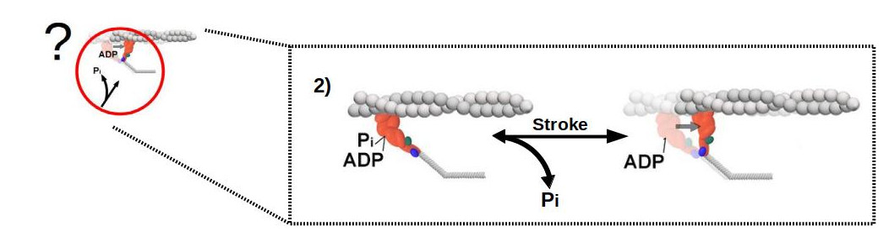
<div style = "padding-left: 300px">
</div>
---
# Two Scenarios
.left-column[
<h2 style="color:black"> 2) P<sub>i</sub>-release gates the powerstroke </h2>
.footnote[Rayment 1993, Gulick 2000, Sweeney & Houdusse 2010, Llinas 2015, Houdusse & Sweeney 2016, Robert-Paganin 2020]
]


<div style = "padding-left: 25px">
<li> X-ray crystallography shows myosin is pre-powerstroke with P<sub>i</sub> in the active site </li>
</div>
---
# Two Scenarios
.left-column[
<h2 style="color:black"> 2) P<sub>i</sub>-release gates the powerstroke </h2>
.footnote[Rayment 1993, Gulick 2000, Sweeney & Houdusse 2010, Llinas 2015, Houdusse & Sweeney 2016, Robert-Paganin 2020]
]


<div style = "padding-left: 25px">
<li> X-ray crystallography shows myosin is pre-powerstroke with P<sub>i</sub> in the active site </li>
<li> Myosin only in a post-powerstroke position when P<sub>i</sub> is absent from active site </li>
</div>
---
# Two Scenarios
.left-column[
<h2 style="color:black"> 2) P<sub>i</sub>-release gates the powerstroke </h2>

<font size = 1>Llinas 2015</font>
<div style="position: fixed; bottom: 0; left: 0; padding-bottom: 20px; padding-left: 20px">
<font color = "grey">Rayment 1993, Gulick 2000, Sweeney & Houdusse 2010, Llinas 2015, Houdusse & Sweeney 2016, Robert-Paganin 2020</font>
</div>
]


<div style = "padding-left: 30px">
<li> Crystallography shows myosin in pre-powerstroke position with P<sub>i</sub> in the active site </li>
<li> Myosin only in a post-powerstroke position when P<sub>i</sub> is absent from active site </li>
<li> Movement of P<sub>i</sub> from active site into the P<sub>i</sub> exit tunnel is rapid </li>
</div>
---

# Two Scenarios
.left-column[
<h2 style="color:black"> 2) P<sub>i</sub>-release gates the powerstroke </h2>

<font size = 1>Llinas 2015</font>
<div style="position: fixed; bottom: 0; left: 0; padding-bottom: 20px; padding-left: 20px">
<font color = "grey">Rayment 1993, Gulick 2000, Sweeney & Houdusse 2010, Llinas 2015, Houdusse & Sweeney 2016, Robert-Paganin 2020</font>
</div>
]


<div style = "padding-left: 30px">
<li> Crystallography shows myosin in pre-powerstroke position with P<sub>i</sub> in the active site </li>
<li>Myosin only in a post-powerstroke position when P<sub>i</sub> is absent from active site </li>
<li> Movement of P<sub>i</sub> from active site into the P<sub>i</sub> exit tunnel is rapid </li>
<li> Suggests why functional assay observe slower P<sub>i</sub>-release rate </li>

--
<li><b> Provides a uniyfing theory between the functional/structural views</b>
</div>
---
class: center, middle

# Can we prevent or delay the powerstroke by occupying the active site with P<sub>i</sub>?
---
<h1 style = "margin-bottom: 20px"> S217A mutation traps P<sub>i</sub> in the active site</h1>
.pull-left[

<div style="margin-top: 100px">
<font color = "grey">Forgacs 2009; Llinas 2015]</font>
</div>
.pull-right[
.center[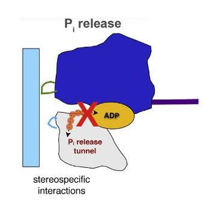]
]
---
# S217A mutation traps P<sub>i</sub> in the active site
.pull-left[

<h4 style = "margin-bottom: 0px; padding-left: 60px"> P<sub>i</sub>-release rates (s<sup>-1</sup>) </h4>

```{r, echo=FALSE, fig.width=5, fig.height=2, fig.cap='At 30uM actin'}
tibble("Article" = c("Forgacs 2009", "Llinas 2015", "Gunther 2020"),
        "WT" = c('198  ± 18', '143 ± 7', '206 ± 34'),
        "S217A" = c("16 ± 1.6", '41 ± 5', '26.6 ± 0.1*')) %>%
  ggpubr::ggtexttable(theme = ggpubr::ttheme('classic', base_size = 20), rows = NULL)
  
```
<br>
<br>
<h2 style = 'margin-top: 0px; padding-left: 30px; padding-bottom: 50px'>P<sub>i</sub>-release ~10-fold slower</h2>
]
.pull-right[
.center[]
]

<div style="position: fixed; bottom: 0; left: 0; padding-bottom: 20px; padding-left: 20px">
<font color = "grey"><i>*At 30 &micro;M Actin</i> <br> <br>Forgacs 2009; Llinas 2015; Gunter 2020</font>
</div>

---
# Single Molecule Laser Trap
.pull-left[
<h3 style = "margin-bottom: 0px"> WT and mutant S217A myo-Va </h3>
<h3 style = "margin-top: 5px; padding-left: 20px">
<li >S1 w/ 1-IQ
</li>
</h3>

<h3 style = "margin-bottom: 5px"> Laser Trap </h3>
<h3 style = 'margin-top: 0px; margin-bottom: 0px; padding-left: 20px'> 
<li> Adhered with Anti-myoC 
<li style = "padding-left: 0px"> 100 &micro;M ATP </li>
</h3>
<h3 style = "margin-bottom: 5px"> Conditions </h3>
<h4 style = 'margin-top: 0px; margin-bottom: 0px; padding-left: 20px'> 
1) WT 0mM-Pi <br>
2) WT 30mM-Pi <br>
3) S217A 0mM-Pi <br>
4) S217A 30mM-Pi 

</h4>
]
.pull-right[
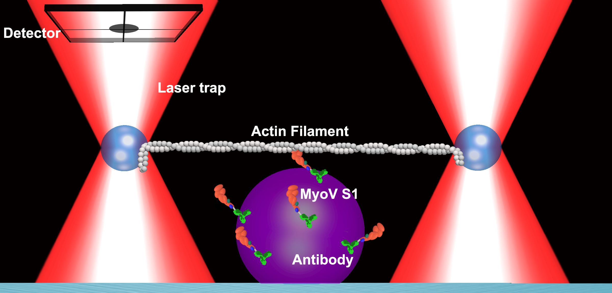
<h3 style = "padding-left: 90px"> Trap stiffness: 0.04pN/nm 
<br>
Sampling Frequency: 5000 Hz
</h3>
]
---
# Expected Outcomes? - A Schematic

.left-column[
### 1) Powerstroke occurs first
]
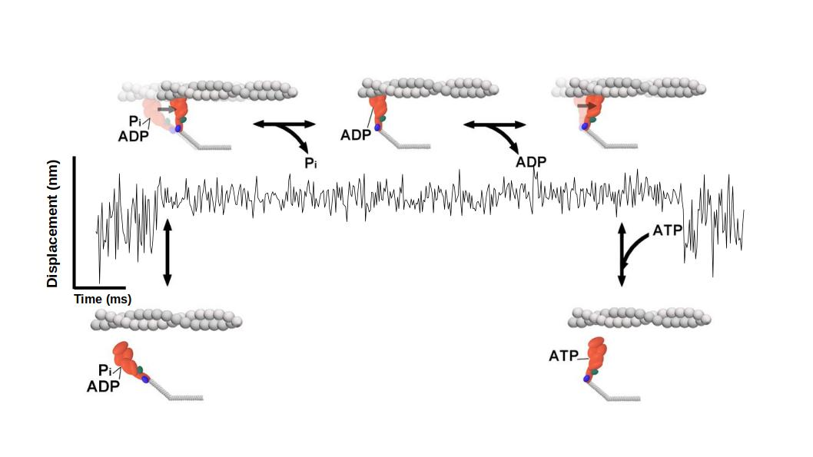

--
<h5 style = 'margin-top: 0px; padding-left: 0px'> High [P<sub>i</sub>] or S217A mutation should not change the magnitude or rate of the powerstroke</h4>
---
# Expected Outcomes? - A Schematic
.left-column[
## 2) P<sub>i</sub>-release gates stroke
]
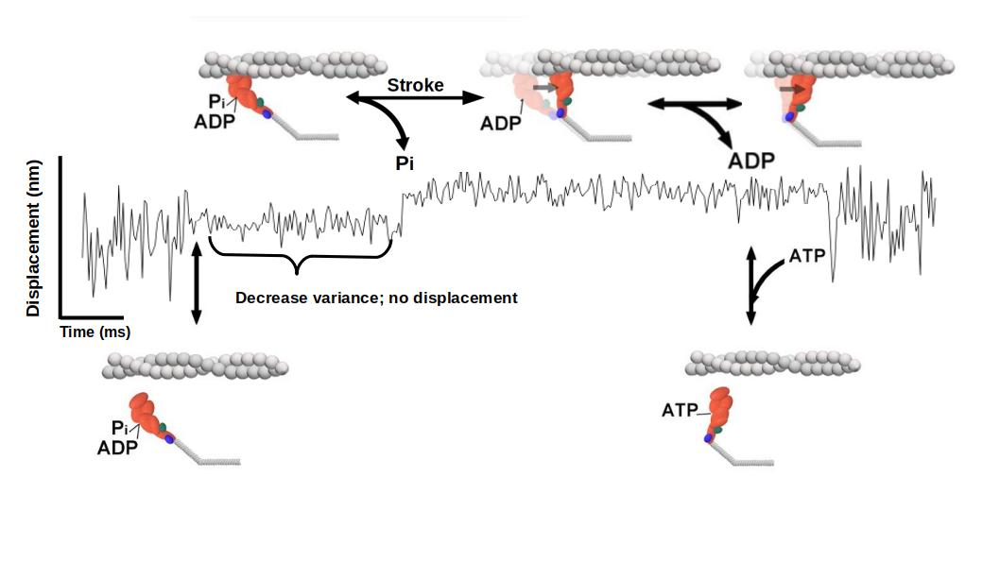
--
<h5 style = 'margin-top: 0px'> High [P<sub>i</sub>] or S217A mutation should decrease/abolish the magnitude and/or rate of the powerstroke</h5>
---
# Analysis - Automated Event Detection
### Hidden-Markov Model + Changepoint Analysis

<div  style = "margin-top: 200px">
<font color = "grey" size = 3> Sleep 2001; Capitanio 2006; Blackwell 2021 <br>
                              R packages: {depmixS4}, {changepoint}, {tidyverse}<font>
</div>
---
# Analysis - Automated Event Detection
### Hidden-Markov Model + Changepoint Analysis
<video preload="none" autoplay muted width="1000" height="200">
 <source src="images/analysis2/5-sec/event-id.mp4" type="video/mp4">
  Your browser does not support the video tag.
</video>
---
<h1 style = "padding-bottom: 0px"> Analysis - Calculating Displacement Distributions </h1>
<div style = "float: right; width: 55%;padding-top: 150px"">
 
</div>

<div style = "float: left; width: 45%; padding-top: 50px">
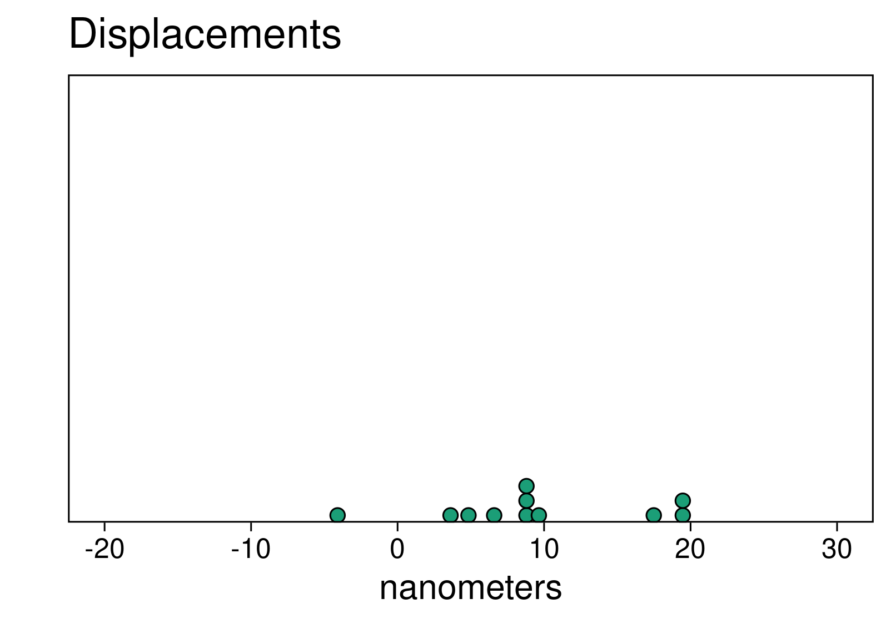
</div> 
---
<h1 style = "padding-bottom: 0px"> Analysis - Calculating Displacement Distributions </h1>
<div style = "float: right; width: 55%;padding-top: 150px"">
<video autoplay muted preload="auto" width="1000" height="150" style = "padding-top: 0px"> 
 <source src="images/analysis2/analyzed-trace-animated/analyzed-trace.mp4" type="video/mp4">
  Your browser does not support the video tag. 
</video>
</div>
<div style = "float: left; width: 45%; padding-top: 50px">
<video autoplay muted preload="auto" width="1000" >
 <source src="images/dotplot/dotplot.mp4" type="video/mp4">
  Your browser does not support the video tag. 
</video>
</div> 
---
# Results - Is the displacement reduced?
.center[

```{r, step, include=TRUE, echo=FALSE, fig.width=10, fig.height=5, message=FALSE, warning=FALSE}
library(ggpubr)
library(ggtext)
library(cowplot)
library(tidyverse)

# save data
# f <- list(project=list(path="~/lasertrapr/project_myoV-phosphate"))
# 
# rv <- list()
# rv$data <- lasertrapr:::summarize_trap_data(f = f,
#                                hz = 5000,
#                                factor_order = c("myoV-WT_pH-7.0_0mM-Pi",
#                                                 "myoV-WT_pH-7.0_30mM-Pi",
#                                                 "myoV-S217A_pH-7.0_0mM-Pi",
#                                                 "myoV-S217A_pH-7.0_30mM-Pi"),
#                                is_shiny = FALSE)
# write_csv(rv$data$event_files_filtered, file = "data/2020-08-09_event-files-filtered.csv")
#write_csv(rv$data$summary, file = "data/summary.csv")

event_files_filtered <- read_csv("data/2020-08-09_event-files-filtered.csv") %>%
  mutate(conditions2 = case_when(
    conditions == "myoV-WT_pH-7.0_0mM-Pi" ~ "WT 0mM-Pi",
    conditions == "myoV-WT_pH-7.0_30mM-Pi" ~"WT 30mM-Pi",
           conditions ==  "myoV-S217A_pH-7.0_0mM-Pi" ~ "S217A 0mM-Pi",
            conditions ==  "myoV-S217A_pH-7.0_30mM-Pi" ~ "S217A 30mM-Pi"
  ))

event_files_filtered$conditions2 <- factor(event_files_filtered$conditions2,
                                           levels = c("WT 0mM-Pi", "WT 30mM-Pi",
                                                      "S217A 0mM-Pi", "S217A 30mM-Pi"))

gaus <- event_files_filtered %>% 
  select(conditions2, displacement_nm) %>% 
  group_by(conditions2) %>% 
  nest(disp = c(displacement_nm)) %>% 
  mutate(curve = map(disp, ~dnorm(.$displacement_nm, mean(.$displacement_nm), sd(.$displacement_nm)))) %>% 
  unnest(cols = c(disp, curve))

summary_data <- read_csv("data/summary.csv") %>%
  mutate(conditions2 = case_when(
    conditions == "myoV-WT_pH-7.0_0mM-Pi" ~ "WT 0mM-Pi",
    conditions == "myoV-WT_pH-7.0_30mM-Pi" ~"WT 30mM-Pi",
           conditions ==  "myoV-S217A_pH-7.0_0mM-Pi" ~ "S217A 0mM-Pi",
            conditions ==  "myoV-S217A_pH-7.0_30mM-Pi" ~ "S217A 30mM-Pi"
  )) %>%
  mutate(mean_label = paste0("bar(x)==",paste(round(displacement_avg, 0), round(displacement_se, 2), sep = "%+-%")),
         n_events = paste0("n == ", num_events))

summary_data$conditions2 <- factor(summary_data $conditions2,
                                           levels = c("WT 0mM-Pi", "WT 30mM-Pi",
                                                      "S217A 0mM-Pi", "S217A 30mM-Pi"))
plot_colors <- c(RColorBrewer::brewer.pal(8, "Blues")[c(5, 8)],
                 RColorBrewer::brewer.pal(8, "Reds")[c(5, 8)])

# step_violion <- ggpubr::ggviolin(event_files_filtered,
#                                 x = "conditions2",
#                                 y = "displacement_nm",
#                                 fill = "conditions2",
#                                 palette = plot_colors,
#                                 add = "boxplot",
#                                 xlab = '',
#                                 ylab = 'Displacement (nm)',
#                                 ggtheme = ggpubr::theme_pubr(base_size=13))+
#   #ggpubr::stat_pvalue_manual(step_tukey, bracket.nudge.y = seq(10, by = 4, length.out = nrow(step_tukey)))+
#   scale_y_continuous(breaks = seq(-50, 1000, by = 15))+
#   theme(legend.position = "none",
#         axis.text.x = element_text(size = 11))
# 
# step_histo <-ggplot(data = event_files_filtered,
#                      aes(x = displacement_nm))+
#   geom_freqpoly(aes(y = stat(density), color = conditions2,),
#                  binwidth = 3,
# 
#                  size = 0.9)+
#   #facet_wrap(~conditions, ncol = 2)+
#   xlab("Step Size (nm)")+
#   scale_y_continuous(expand = c(0,0))+
#   scale_x_continuous(breaks = seq(-100, 100, by = 10))+
#   scale_color_manual(values = plot_colors)+
#   #scale_fill_brewer(palette = "Dark2")+
#   theme_cowplot(font_size = 13)+
#   theme(panel.grid = element_blank(),
#         legend.position = 'none')
# #rotate_x_text(angle = 45)

summary_data2 <- filter(summary_data, conditions2 %in% c('WT 0mM-Pi', 'WT 30mM-Pi'))
gaus2 <- filter(gaus, conditions2 %in% c('WT 0mM-Pi', 'WT 30mM-Pi'))

suppressWarnings( ggplot(data = filter(event_files_filtered, conditions2 %in% c('WT 0mM-Pi', 'WT 30mM-Pi')),
                     aes(x = displacement_nm))+
  geom_histogram(aes(y = stat(density), fill = conditions2), size = 0.9,
                 color = "black",
                 binwidth = 3)+
  geom_text(data = summary_data2,
                aes(x = Inf, y =Inf, label = mean_label), parse=T,
                  fill = NA, label.color = NA, size = 6,
                vjust = 1.2, 
                hjust = 1.1,# remove background and outline
    label.padding = grid::unit(rep(0, 4), "pt"))+
    geom_text(data = summary_data2,
                aes(x = -Inf, y =Inf, label = n_events), parse = T,
                  fill = NA, label.color = NA, size = 6,
                vjust = 1.2, 
                hjust = -0.1,# remove background and outline
    label.padding = grid::unit(rep(0, 4), "pt"))+
    
    geom_line(data = gaus2, aes(x = displacement_nm, y = curve), linetype = 'solid', size = 1)+
   
  facet_wrap(~conditions2, ncol = 4)+
  xlab("Displacement (nm)")+
  ylab("Density")+
  scale_y_continuous(expand = c(0,0))+
  scale_x_continuous(breaks = seq(-100, 100, by = 10))+
  #  coord_cartesian(ylim = c(0, 3))+
  scale_fill_manual(values = plot_colors)+
  #scale_fill_brewer(palette = "Dark2")+
  theme_linedraw(base_size = 22)+
  theme(panel.grid = element_blank(),
        legend.position = 'none',
    
        #axis.line.y = element_blank(),
        # axis.text.y = element_blank(),
        # axis.ticks.y = element_blank(),
        #strip.background = element_rect("white"),
        strip.text = element_text(face = "bold"))
)

```
]

--
### .center[WT has a similiar displacement in both 0mM-Pi and 30mM-Pi]
---
# Results - Is the displacement reduced?
.center[

```{r, step2, include=TRUE, echo=FALSE, fig.width=15, fig.height=5, message=FALSE, warning=FALSE}

summary_data3 <- filter(summary_data, conditions2 %in% c('WT 0mM-Pi', 'WT 30mM-Pi', 'S217A 0mM-Pi'))
gaus3 <- filter(gaus, conditions2 %in% c('WT 0mM-Pi', 'WT 30mM-Pi', 'S217A 0mM-Pi'))

ggplot()+

  geom_histogram(data = filter(event_files_filtered, conditions2 %in% c('WT 0mM-Pi', 'WT 30mM-Pi', 'S217A 0mM-Pi')),
                 aes(x = displacement_nm, y = stat(density), fill = conditions2), size = 0.9,
                 color = "black",
                 binwidth = 3)+
  geom_text(data = summary_data3,
                aes(x = Inf, y =Inf, label = mean_label),
                  fill = NA, label.color = NA, size = 6, parse=T,
                vjust = 1.2, 
                hjust = 1.1,# remove background and outline
    label.padding = grid::unit(rep(0, 4), "pt"))+
    geom_text(data = summary_data3,
                aes(x = -Inf, y =Inf, label = n_events),
                  fill = NA, label.color = NA, size = 6, parse=T,
                vjust = 1.2, 
                hjust = -0.1,# remove background and outline
    label.padding = grid::unit(rep(0, 4), "pt"))+
   geom_line(data = gaus3, aes(x = displacement_nm, y = curve), linetype = 'solid', size = 1)+
  
  facet_wrap(~conditions2, ncol = 4)+
  xlab("Displacement (nm)")+
  ylab("Density")+
  scale_y_continuous(expand = c(0,0))+
  scale_x_continuous(breaks = seq(-100, 100, by = 10))+
  #  coord_cartesian(ylim = c(0, 3))+
  scale_fill_manual(values = plot_colors)+
  #scale_fill_brewer(palette = "Dark2")+
  theme_linedraw(base_size = 22)+
  theme(panel.grid = element_blank(),
        legend.position = 'none',
        #axis.line.y = element_blank(),
        # axis.text.y = element_blank(),
        # axis.ticks.y = element_blank(),
        #strip.background = element_rect("white"),
        strip.text = element_text(face = "bold"))

```
]

---
# Results - Is the displacement reduced?
.center[

```{r, step4, include=TRUE, echo=FALSE, fig.width=15, fig.height=5, message=FALSE, warning=FALSE}


ggplot()+
    # geom_rect(data = filter(event_files_filtered, conditions2 == "S217A 0mM-Pi"), xmin = -Inf,xmax = Inf, ymin = -Inf,ymax = Inf, fill = "red", alpha = 0.005) +
  geom_histogram(data = event_files_filtered,
                 aes(x = displacement_nm, y = stat(density), fill = conditions2), size = 0.9,
                 color = "black",
                 binwidth = 3)+
  geom_text(data = summary_data,
                aes(x = Inf, y =Inf, label = mean_label),
                  fill = NA, label.color = NA, size = 6, parse=T,
                vjust = 1.2, 
                hjust = 1.1,# remove background and outline
    label.padding = grid::unit(rep(0, 4), "pt"))+
    geom_text(data = summary_data,
                aes(x = -Inf, y =Inf, label = n_events),
                  fill = NA, label.color = NA, size = 6, parse=T,
                vjust = 1.2, 
                hjust = -0.1,# remove background and outline
    label.padding = grid::unit(rep(0, 4), "pt"))+
   geom_line(data = gaus, aes(x = displacement_nm, y = curve), linetype = 'solid', size = 1)+
  
  facet_wrap(~conditions2, ncol = 4)+
  xlab("Displacement (nm)")+
  ylab("Density")+
  scale_y_continuous(expand = c(0,0))+
  scale_x_continuous(breaks = seq(-100, 100, by = 10))+
  #  coord_cartesian(ylim = c(0, 3))+
  scale_fill_manual(values = plot_colors)+
  #scale_fill_brewer(palette = "Dark2")+
  theme_linedraw(base_size = 22)+
  theme(panel.grid = element_blank(),
        legend.position = 'none',
        #axis.line.y = element_blank(),
        # axis.text.y = element_blank(),
        # axis.ticks.y = element_blank(),
        #strip.background = element_rect("white"),
        strip.text = element_text(face = "bold"))

```
]
--
.center[### No reduction in magnitude of displacement in S217A]
---
# What is rate of transition between unbound to bound?
##.center[Ensemble Average]

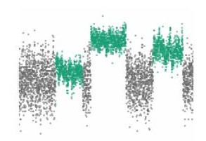

---
# What is rate of transition between unbound to bound?
<h2 style = "padding-bottom: 0px; text-align: center; margin-bottom: 0px">Ensemble Average</h2>
<video autoplay muted preload="auto" width="700" height="400" style = "padding-top: 0px">
 <source src="images/ee-how-to/gif/how-to-ee.mp4" type="video/mp4"> 
  Your browser does not support the video tag. 
</video>

---
# What is rate of transition between unbound to bound?
<h2 style = "padding-bottom: 0px; text-align: center; margin-bottom: 0px">Ensemble Average</h2>
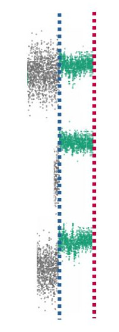 
<video autoplay muted preload="auto" width="650" height="350" style = "padding-top: 50px; padding-left: 125px; float: right;">
 <source src="images/ee-figs/gif3/ee2.mp4" type="video/mp4">
  Your browser does not support the video tag. 
</video>
---
<h1 style = "margin-bottom: 0px">S217A Simulations - What should we observe?</h1>
<h3 style = "margin-bottom: 0px; margin-top: 15px"> Data simulated with a slowed P<sub>i</sub> release (30 s<sup>-1</sup>) </h3>
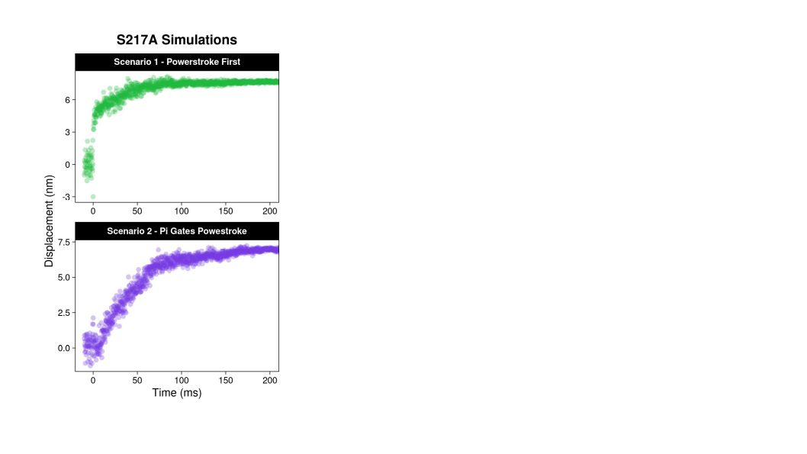
---
<h1 style = "margin-bottom: 0px">S217A Simulations - What should we observe?</h1>
<h3 style = "margin-bottom: 0px; margin-top: 15px"> Data simulated with a slowed P<sub>i</sub> release (30 s<sup>-1</sup>) </h3>
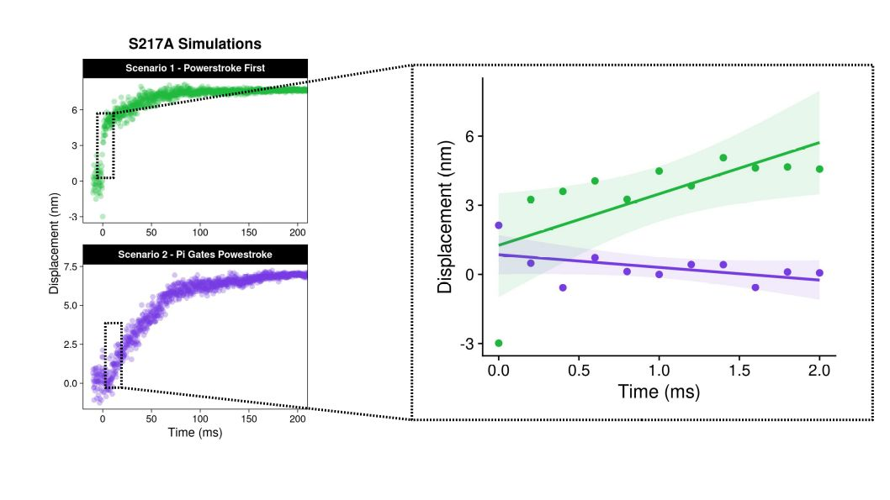
---
<h2 style = "margin-bottom: 20px"> Results - Is the rate of transition between unbound/bound reduced? </h2>
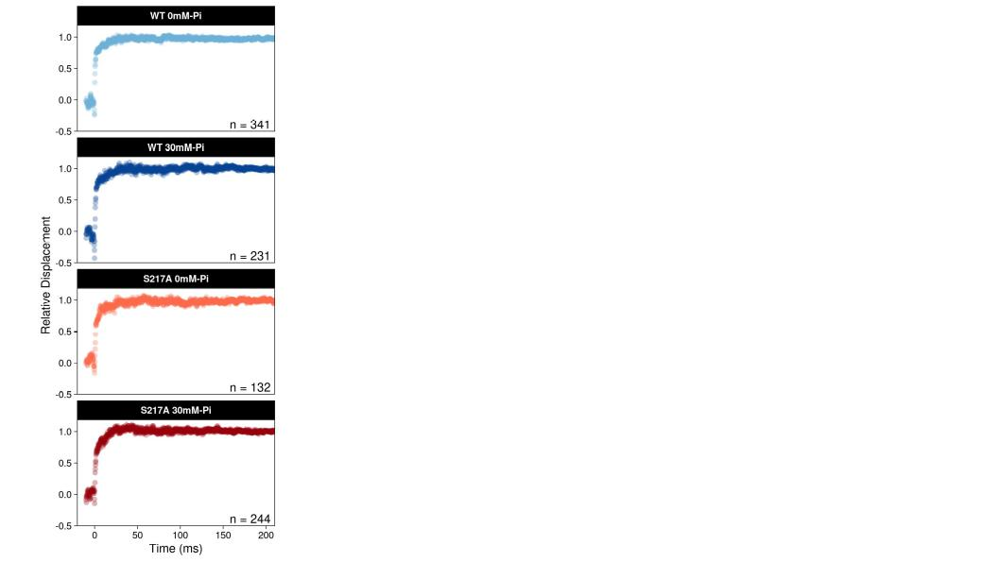
---
<h2 style = "margin-bottom: 20px"> Results - No change in transition rate </h2>
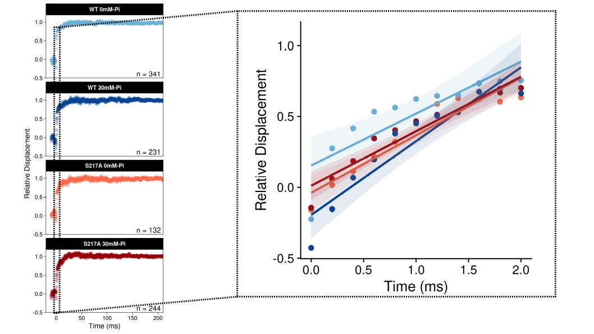
---
<h2 style = "margin-bottom: 20px"> Results - All conditions are identical to Powerstroke First Simulation </h2>
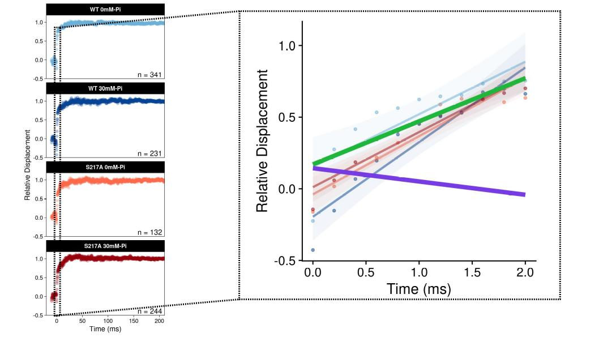
---
# Brief Recap
<h3 style = 'margin-bottom: 0px'><li> In high [P<sub>i</sub>] and with the S217A mutation - myosin produced a displacement</li></h3>

--
<h3 style = 'margin-bottom: 0px'><li> There was no change in the rate of transition between unbound/bound</li></h3>

--

<h3 style = 'margin-bottom: 0px'><li> Data are consistent with a model where the powerstroke preceeds P<sub>i</sub>-release </li></h3>


---
# What happens after the powerstroke?
 
 - Attachment time is dependent on rates of P<sub>i</sub>-release, ADP-release, and ATP binding. 
 
 
```{r, echo=FALSE, fig.height = 6}
cum_freq_curves <-
  event_files_filtered %>% 
  split(.$conditions) %>% 
  imap_dfr(~ .x %>% dplyr::summarize(conditions = .y,
                                 time_on = unique(time_on_ms), 
                                 ecdf = ecdf(time_on_ms)(unique(time_on_ms)))) %>% 
  separate(conditions, c("myo", "ph", "pi"), sep = "_", remove = FALSE )
   
cum_freq_curves$conditions <- factor(cum_freq_curves$conditions, 
                                     levels =  c("myoV-WT_pH-7.0_0mM-Pi",
                                                  "myoV-WT_pH-7.0_30mM-Pi",
                                                  "myoV-S217A_pH-7.0_0mM-Pi",
                                                  "myoV-S217A_pH-7.0_30mM-Pi"))

cum_freq_curves$myo <- factor(cum_freq_curves$myo, 
                              levels =  c("myoV-WT",
                                          "myoV-S217A"))
cum_freq_plot <- 
  ggplot(cum_freq_curves, aes(time_on, ecdf)) + 
  geom_step(aes(color = conditions), size = 0.75)+
  #coord_cartesian(c(0, 1000))+
  #facet_grid(~myo)+
  ggtitle("Attachment Times")+
  ylab("Cumulative Distribution")+
  xlab("Time (ms)")+
  scale_color_manual(values = plot_colors)+
  #  coord_cartesian(c(0, 2000), c(0.75, 1))+
  theme_cowplot(20)+
  theme(panel.grid = element_blank(),
        legend.position = "n")

cum_freq_plot


```
 
---
# What happens after the powerstroke?
 
 - Attachment time is dependent on rates of P<sub>i</sub>-release, ADP-release, and ATP binding. 
 
```{r, echo=FALSE, fig.height=6, fig.width=14}
cum_freq_plot <- 
  cum_freq_plot + geom_rect(aes(xmin=0, xmax=2000, ymax=1.05, ymin=0.75), fill = "grey80", alpha = 0.01)


cum_freq_plot2 <- 
  ggplot(cum_freq_curves, aes(time_on, ecdf)) + 
  geom_step(aes(color = conditions), size = 0.75)+
  annotate(geom = "text", x = 1500, y = 0.95, label = "WT 0mM-Pi", color = plot_colors[[1]], size = 8)+
  #coord_cartesian(c(0, 1000))+
  #facet_grid(~myo)+
  ggtitle("Zoomed")+
  ylab("Cumulative Distribution")+
  xlab("Time (ms)")+
  scale_color_manual(values = plot_colors)+
  coord_cartesian(c(0, 2000), c(0.75, 1))+
  theme_cowplot(20)+
  theme(panel.grid = element_blank(),
        legend.position = "n")

plot_grid(cum_freq_plot, cum_freq_plot2)

```
---
# What happens after the powerstroke?
 
 - High levels of [P<sub>i</sub>] decreased time myosin was bound to actin
 
```{r, echo=FALSE, fig.height=6, fig.width=14}
time_on_table <- 
  summary_data %>% 
  dplyr::select("Conditions" = conditions2,
                "Average" = time_on_avg, 
                "Median" = time_on_median) %>% 
  mutate(across(where(is.numeric), ~round(., 1))) %>% 
ggtexttable(
    rows = NULL, theme = ttheme(base_size = 4,
    colnames.style = colnames_style(fill = "black", color = "white", size = 18),
    tbody.style = tbody_style(size = 18,  fill = alpha(plot_colors, 0.5)))) %>% 
   tab_add_title(text = "Attachment Times", face = "bold", padding = unit(0.1, "line"), size = 22)
plot_grid(time_on_table, cum_freq_plot2)
```

<div style = "font-size: 10pt">A comparison of the 0 versus 30 mM Pi distributions using a Kolmogorov–Smirnov, nonparametric test reveal a trend (p =.06) toward a difference</div>
---
# A model of molecular force generation
- Power stroke occurs upon actin binding, before the release of P<sub>i</sub>
- Alternative pathway where P<sub>i</sub> can induce premature detachment
  + Our data provides no direct evidence of reversals, but imposes constraints if they do occur
<br>
<br>
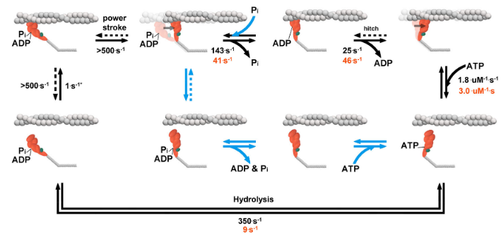
---
# Moving Forward
- Can the results of single molecule studies be reconciled with those from structural biology?
  + Is actin the missing link?
- Is there a load dependence to the re-binding P<sub>i</sub>?
  + Would this effect be different between WT and S217A? Could indicate role of SWI

<br>

---
# Conclusions 
<h3 style = "margin-bottom: 0px">Providing insight into how myosin transduces energy</h3>
<div style = "display: flex; width: 50%; float: left">

</div>

<div style = "display: flex; width: 50%; float: right">
<div style ="width: 90%; float: left;">

<br>

</div>
---
# Conclusions 
<h3 style = "margin-bottom: 0px">Providing molecular mechanisms underlying human motion</h3>
<div style = "display: flex; width: 50%; float: left">

</div>

<div style = "display: flex; width: 50%; float: right">
<div style ="width: 90%; float: left;">
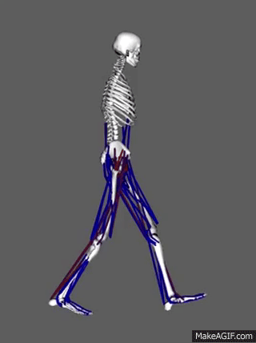
<br>
---
class: inverse
# Acknowledgements
<div style = "float: left; width: 50%">
<h2 style = "margin-bottom: 5px"> Debold Lab</h2>
<h3 style = "margin-top: 0px; margin-bottom: 0px";">
<li style = "padding-left: 20px"> Ned Debold, PhD </li></h3> 
<h3 style = "margin-top: 0px; margin-bottom: 0px";">
<li style = "padding-left: 20px"> Chris Marang, MS </li></h3> 
<h3 style = "margin-top: 0px; margin-bottom: 40px;">
<li style = "padding-left: 20px"> Mike Woodward, MS </li></h3>

<h2 style = "margin-bottom: 5px; maring-top: 40px;">Open Source Software</h2>
<h3 style = "margin-top: 0px; margin-bottom: 0px";">
<li style = "padding-left: 20px"> R/R Studio/R Community </li></h3> 
<h3 style = "margin-top: 0px; margin-bottom: 0px";">
<li style = "padding-left: 20px"> Linux/Ubuntu/Mint </li></h3> 

</div>

<div style = "float: right; width: 50%">
<h2 style = "margin-bottom: 5px">Yengo Lab</h2>
<h3 style = "margin-top: 0px; margin-bottom: 0px";">
<li style = "padding-left: 20px"> Chris Yengo, PhD</li></h3> 
<h3 style = "margin-top: 0px; margin-bottom: 60px";">
<li style = "padding-left: 20px">Laura Gunther, PhD </li></h3> 

<h2 style = "margin-bottom: 0px; margin-top: 40px;">The Scott Fam</h2>
<h3 style = "margin-bottom: 5px; margin-top: 0px"> 
<li style = "padding-left: 20px">Megan</li></h3>
<h3 style = "margin-top: 0px; margin-bottom: 0px";">
<li style = "padding-left: 30px"> Marilyn (3) </li></h3> 
<h3 style = "margin-top: 0px; margin-bottom: 0px";">
<li style = "padding-left: 30px">Mollie (2) </li></h3> 
<h3 style = "margin-top: 0px; margin-bottom: 40px";">
<li style = "padding-left: 30px"> Anna (9 mo.) </li></h3>
</div>

---
class: inverse
# Debold lab students about to hit free agency...
<h3 style = "margin-top: 0px; margin-bottom: 10px;">
<li style = "padding-left: 20px"> Mike Woodward, MS - ETA Spring 2022 </li></h3>
<h3 style = "margin-top: 0px; margin-bottom: 10px;">
<li style = "padding-left: 20px"> Brent Scott, MS - ETA Spring 2022 </li></h3>
<h3 style = "margin-top: 0px; margin-bottom: 10px";">
<li style = "padding-left: 20px"> Chris Marang, MS - ETA Spring 2023 </li></h3> 

## ...looking for a post-doc?

---
