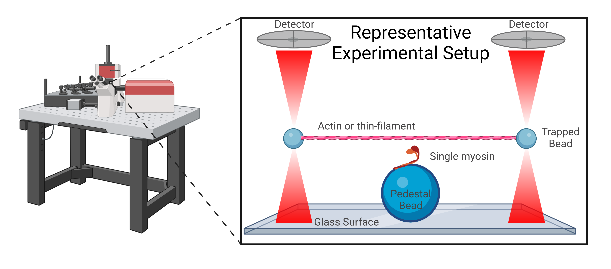
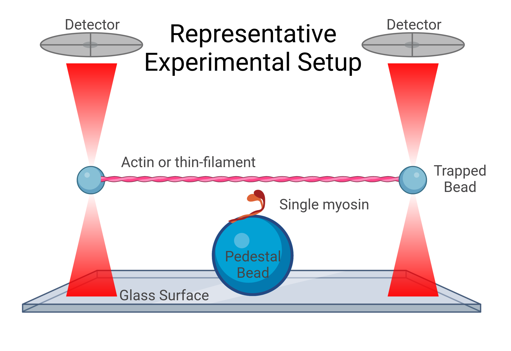
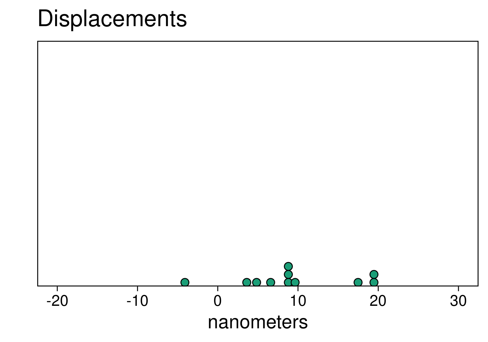
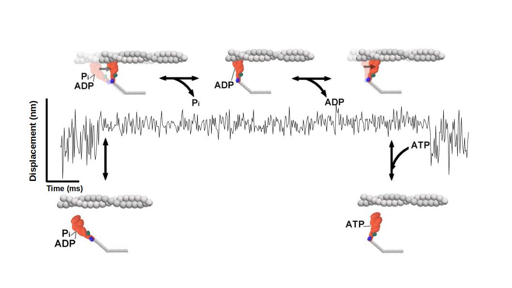
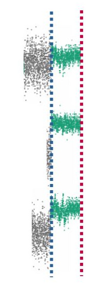
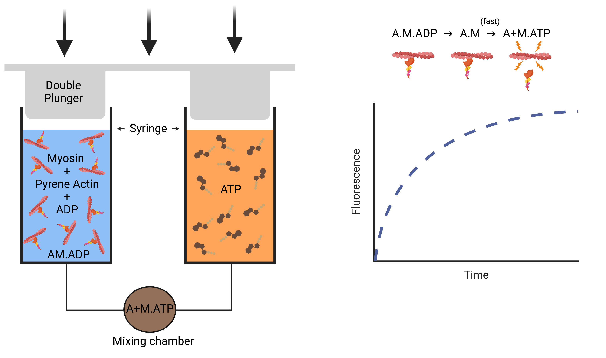

```{r, eval = FALSE, echo = FALSE}
library(xaringan)
options(browser = "firefox")
inf_mr("index.Rmd")
```
<style>

.center2 {
  margin: 0;
  position: absolute;
  top: 50%;
  left: 50%;
  -ms-transform: translate(-50%, -50%);
  transform: translate(-50%, -50%);
}


.footnote2 {
  margin: 0;
  position: absolute;
  top: 95%;
  left: 5%;
}

</style>


# The heart generates force to pump blood
.center[
 

### Ventricular walls contain muscle fibers (cells)
]
---
## Muscle fibers are comprised of myofibrils containing sarcomeric proteins
.center[
 
<br>
.footnote2[Image from Barrick & Greenberg 2021]
]
---
.center2[

### $\beta$-cardiac myosin is in human ventricles (MYH7)
]
---
# Molecular force generated by myosin's crossbridge cycle
.center[]
.footnote2[Image from Barrick & Greenberg 2021]
---
## Biophysical and biochemical approaches used to characterize the cycle
---
## Biophysical and biochemical approaches used to characterize the cycle
.pull-left[
### Mechanics (force)
- Optical trapping
- Isometric force clamping 
]
.pull-right[
### Kinetics (rates)
- Steady state solution kinetics 
- Stopped flow transient kinetics 
]
---
## Biophysical and biochemical approaches used to characterize the cycle
.pull-left[
### Mechanics (force)
- Optical trapping
- Isometric force clamping
]
.pull-right[
### Kinetics (rates)
- Steady state solution kinetics
- Stopped flow transient kinetics
]
<br>
<br>
<br>
.center[

### *However, these studies have only been performed with $\beta$-myosin + actin only*
]
---
## The thin-filament shown to have mixed effects on myosin function...
  
--

**Regulatory proteins reduce skeletal myosin's unitary step size** and slow detachment from actin (Kad 2005)

--


Conversely, the **regulatory proteins have no effect on skeletal myosin's step size across a range of [Ca<sup>2+</sup>]**, but decrease myosin's attachment rate to actin (Longyear 2017)

--

Tropomyosin 4.2 increases force sensitivity of non-muscle myosin IIa (Hundt 2016)

--

Myosin-V (Myo2p) only walks processively in the presence of Tm (Hodges 2012)


--
<br>
.center[
### The thin-filament effects on $\beta$-cardiac myosin are unknown
]

---
.center[

]


---
# Optical trap


---
# Optical trap


---
# Optical trap



---
.pull-left[
<h3 style = "text-align: center; margin-top: 100px"> Use a Single Molecule Laser Trap... </h3>
 
<br>
</h3>
]
.pull-right[
<h4 style = "text-align: center;  margin-top: 100px; color: white">Trapping Beads</h4>
<div  style = "width: 400px; margin: 0 auto; text-align: center">
<video>
  <source src="images/trapping-beads.mp4" type="video/mp4"> 
 </video>
</div>
]

---
.pull-left[
<h3 style = "text-align: center; margin-top: 100px"> Use a Single Molecule Laser Trap... </h3>

]
.pull-right[
<h4 style = "text-align: center;  margin-top: 170px; color: black">Brightfield & Fluorescent Fields</h4>
<div  style = "width: 400px; margin: 0 auto; text-align: center">

]
---
.pull-left[
<h3 style = "text-align: center; margin-top: 100px"> Use a Single Molecule Laser Trap... </h3>

]

.pull-right[
<h3 style = "text-align: center; margin-top: 100px"> To observe single molecule interactions </h3>

]
---

class: middle
# Data is a time series 


---

<h1 style = "padding-bottom: 0px"> Analysis - Calculating Displacement Distributions </h1>
<ul>
<li> Individual Displacement Point = myosin step size + brownian noise
<li> Average of the distribution is the size of myosin's powerstroke
</ul>
<div style = "float: right; width: 55%;padding-top: 150px"">
 
</div>

<div style = "float: left; width: 45%; padding-top: 50px">

</div> 
---
<h1 style = "padding-bottom: 0px"> Analysis - Calculating Displacement Distributions </h1>
<div style = "float: right; width: 55%;padding-top: 150px"">
<video muted preload="auto" width="1000" height="145" style = "padding-top: 0px"> 
 <source src="images/analyzed-trace.mp4" type="video/mp4">
  Your browser does not support the video tag. 
</video>
</div>
<div style = "float: left; width: 45%; padding-top: 50px">
<video autoplay muted preload="auto" width="1000" >
 <source src="images/dotplot.mp4" type="video/mp4">
  Your browser does not support the video tag. 
</video>
</div> 


---

## Converting displacements to forces

- ~0.02 pN/nm


---
# $\beta$-cardiac myosin's force unchanged by thin-filament
- $Force = \delta * k_{trap}$


---
# Ensemble averaging reveals underlying mechanics
- Myosin has 2 powerstrokes
    1. Occurs rapidly upon actin binding
    2. Associated w/ ADP release
- Not evident in single events




---

# How to ensemble average


---
# Conceptual representation
##.center[Ensemble Average]


---
# Ensemble Average
<video muted preload="auto" width="95% " style = "padding-top: 0px; outline: none;">
 <source src="images/how-to-ee.mp4" type="video/mp4"> 
  Your browser does not support the video tag. 
</video>

---

# Ensemble Average

<div style = "width: 15%; padding-top: 50px; padding-left: 125px; float: left;">
 
</div>

<div style = "width: 50%; padding-top: 50px; padding-left: 125px; float: right;">
<video>
 <source src="images/ee2.mp4" type="video/mp4">
  Your browser does not support the video tag. 
</video>
</div>
---

## Thin-filament does not alter $\beta$-cardiac myosin's mechanical substeps 


---
# Attachment time prolonged by the thin-filament

- at low [ATP] (1 &micro;M)


---

<h1 style = "text-align: center;">Why?</h1>


.center[]
.footnote2[Image from Barrick & Greenberg 2021]

<!--  -->

---
# Stopped flow transient kinetics - ADP Release



---
# Stopped flow transient kinetics - ADP Release
- Rate of ADP-release is unchanged by thin-filament


---

# Stopped flow transient kinetics - ATP Induced Dissociation


---
# Stopped flow transient kinetics - ATP Induced Dissociation
- Second order rate of ATP induced dissociation is slowed by the regulatory proteins
  - Unregulated =   $4~(\mu M^{-1} \cdot s^{-1})$
  - Regulated = $2~(\mu M^{-1} \cdot s^{-1})$


---

# Stopped flow transient kinetics - ATP Induced Dissociation
- Second order rate of ATP induced dissociation is slowed by the regulatory proteins
  - Unregulated =   $4~(\mu M^{-1} \cdot s^{-1})$
  - Regulated = $2~(\mu M^{-1} \cdot s^{-1})$
- However, this effect not relevant at physiological [ATP]

.center[]
.footnote2[Image from Barrick & Greenberg 2021]

---
# Myosin's kinetics are load dependent
- Implied by muscle's force/velocity relationship


.footnote2[Image from AV Hill 1938]

---
# Is myosin's load dependence altered by the thin-filament?

.center[]
.footnote2[Image from Barrick & Greenberg 2021]

---
# Isometric Force Clamp


---
# Isometric Force Clamp
- No change in load dependence with regulatory proteins


---
# Summary 


- Thin-filament does not alter myosin's mechanics
  - Total displacement or magnitude of substeps
  - Load dependence unchanged
--

- Kinetics are slowed only at low [ATP]
  - Biophysically interesting, implies more than a basic steric blocking by tropomyosin
  - Not relevant at physiological [ATP]
--

- Important implications for modelling of muscle contraction and disease

---
class: inverse
# Acknowledgements
<div style = "float: left; width: 33%">
<h2 style = "margin-bottom: 5px"> Greenberg Lab</h2>
<h3 style = "margin-top: 0px; margin-bottom: 0px";">
<li style = "padding-left: 20px"> Lina Greenberg, PhD </li></h3> 
<h3 style = "margin-top: 0px; margin-bottom: 0px";">
<li style = "padding-left: 20px"> Sam Barrick, PhD </li></h3> 
<h3 style = "margin-top: 0px; margin-bottom: 0px";">
<li style = "padding-left: 20px"> Ankit Garg, MD, PhD </li></h3> 
<h3 style = "margin-top: 0px; margin-bottom: 0px";">
<li style = "padding-left: 20px"> Sayli Modak, MS </li></h3> 
<h3 style = "margin-top: 0px; margin-bottom: 40px;">
<li style = "padding-left: 20px"> Sarah Clippinger, PhD</li></h3>


</div>

<div style = "float: left; width: 33%">
<h2 style = "margin-bottom: 5px">Current Funding</h2>
<h3 style = "margin-top: 0px; margin-bottom: 0px";">
<li style = "padding-left: 20px"> Pediatric Cardiopulmonary Disease T23</li></h3> 

<h2 style = "margin-bottom: 0px; margin-top: 40px;">The Scott Fam</h2>
<h3 style = "margin-bottom: 5px; margin-top: 0px"> 
<li style = "padding-left: 20px">Megan</li></h3>
<h3 style = "margin-top: 0px; margin-bottom: 0px";">
<li style = "padding-left: 30px"> Marilyn (5) </li></h3> 
<h3 style = "margin-top: 0px; margin-bottom: 0px";">
<li style = "padding-left: 30px">Mollie (4) </li></h3> 
<h3 style = "margin-top: 0px; margin-bottom: 0px";">
<li style = "padding-left: 30px"> Anna (2) </li></h3>
<h3 style = "margin-top: 0px; margin-bottom: 40px";">
<li style = "padding-left: 30px"> Amy (1) </li></h3>
</div>

<div style = "float: left; width: 33%">
<h2 style = "margin-bottom: 5px; maring-top: 40px;">Open Source Software</h2>
<h3 style = "margin-top: 0px; margin-bottom: 0px";">
<li style = "padding-left: 20px"> R/R Community/ESS </li></h3> 
<h3 style = "margin-top: 0px; margin-bottom: 0px";">
<li style = "padding-left: 20px"> NixOS/Linux </li></h3> 
<!-- <h2 style = "margin-bottom: 5px">Committee</h2> -->
<!-- <h3 style = "margin-top: 0px; margin-bottom: 0px";"> -->
<!-- <li style = "padding-left: 20px"> Ned Debold, PhD</li> -->
<!-- <li style = "padding-left: 20px"> Marco Capitanio, PhD</li> -->
<!-- <li style = "padding-left: 20px"> Wouter Hoogkamer, PhD</li> -->
<!-- <li style = "padding-left: 20px"> Jimi Oke, PhD</li> -->
<!-- </h3> -->

<!--  -->
</div>
---

class: inverse
# Acknowledgements
<div style = "float: left; width: 33%">
<h2 style = "margin-bottom: 5px"> Greenberg Lab</h2>
<h3 style = "margin-top: 0px; margin-bottom: 0px";">
<li style = "padding-left: 20px"> Lina Greenberg, PhD </li></h3> 
<h3 style = "margin-top: 0px; margin-bottom: 0px";">
<li style = "padding-left: 20px"> Sam Barrick, PhD </li></h3> 
<h3 style = "margin-top: 0px; margin-bottom: 0px";">
<li style = "padding-left: 20px"> Ankit Garg, MD, PhD </li></h3> 
<h3 style = "margin-top: 0px; margin-bottom: 0px";">
<li style = "padding-left: 20px"> Sayli Modak, MS </li></h3> 
<h3 style = "margin-top: 0px; margin-bottom: 40px;">
<li style = "padding-left: 20px"> Sarah Clippinger, PhD</li></h3>


</div>

<div style = "float: left; width: 33%">
<h2 style = "margin-bottom: 5px">Current Funding</h2>
<h3 style = "margin-top: 0px; margin-bottom: 0px";">
<li style = "padding-left: 20px"> Pediatric Cardiopulmonary Disease T23</li></h3> 

<h2 style = "margin-bottom: 0px; margin-top: 40px;">The Scott Fam</h2>
<h3 style = "margin-bottom: 5px; margin-top: 0px"> 
<li style = "padding-left: 20px">Megan</li></h3>
<h3 style = "margin-top: 0px; margin-bottom: 0px";">
<li style = "padding-left: 30px"> Marilyn (5) </li></h3> 
<h3 style = "margin-top: 0px; margin-bottom: 0px";">
<li style = "padding-left: 30px">Mollie (4) </li></h3> 
<h3 style = "margin-top: 0px; margin-bottom: 0px";">
<li style = "padding-left: 30px"> Anna (2) </li></h3>
<h3 style = "margin-top: 0px; margin-bottom: 40px";">
<li style = "padding-left: 30px"> Amy (1) </li></h3>
</div>

<div style = "float: left; width: 33%">
<h2 style = "margin-bottom: 5px; maring-top: 40px;">Open Source Software</h2>
<h3 style = "margin-top: 0px; margin-bottom: 0px";">
<li style = "padding-left: 20px"> R/R Community/ESS </li></h3> 
<h3 style = "margin-top: 0px; margin-bottom: 0px";">
<li style = "padding-left: 20px"> NixOS/Linux </li></h3> 
<!-- <h2 style = "margin-bottom: 5px">Committee</h2> -->
<!-- <h3 style = "margin-top: 0px; margin-bottom: 0px";"> -->
<!-- <li style = "padding-left: 20px"> Ned Debold, PhD</li> -->
<!-- <li style = "padding-left: 20px"> Marco Capitanio, PhD</li> -->
<!-- <li style = "padding-left: 20px"> Wouter Hoogkamer, PhD</li> -->
<!-- <li style = "padding-left: 20px"> Jimi Oke, PhD</li> -->
<!-- </h3> -->


</div>
---
class: inverse, center, middle

# EXTRA SLIDES AHEAD
---


