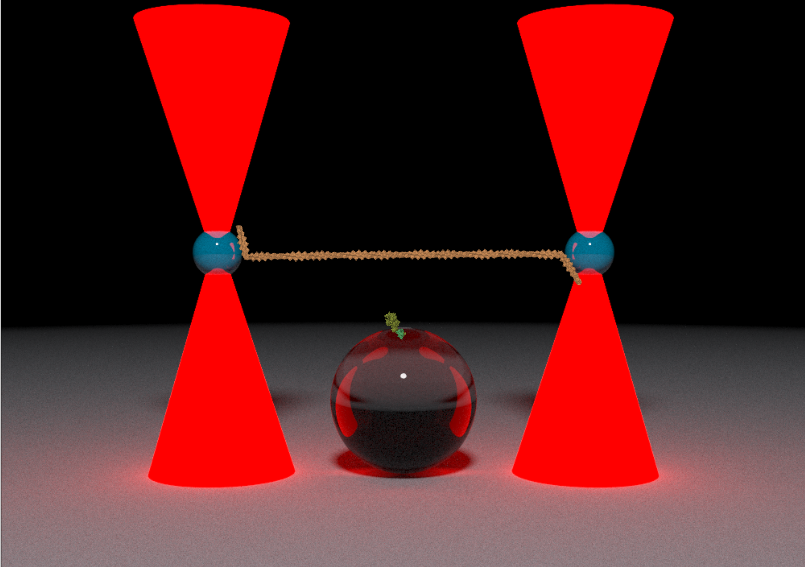

```{r xaringanExtra-clipboard, echo=FALSE}
xaringanExtra::use_clipboard()
```

# What are some things I use R for?

### Statistics, of course

--
  
### BUT - I probably spend *least* amount of time actually performing statistical tests in R...
  
--
  
### So, what am I spending all my time in R doing?
  
---

### These slides created via the R package [**xaringan**](https://github.com/yihui/xaringan).
  - an RMarkdown document

--

### My dissertation
- RMarkdown rendered to both PDF (LaTex) and HTML format
- Uses conditional rendering!
  
--

### Websites
  - Both, personal (brentscott.us) and W&M research lab (myolab.org)
- {blogdown}

---
  # What are some things I use R for?
  ### My CV
  - Autoformatted RMarkdown {pagedown}
- https://brentscott.us/cv.pdf

--

### Software GUIs
- Graphical user interfaces to share analysis programs
- Non-technical users can use scripts
- {shiny}

---
  ### Interactive graphs {dygraphs}
  
```{r out.height=200}
library(dygraphs)
lungDeaths <- cbind(mdeaths, fdeaths)
dygraph(lungDeaths)%>% dyRangeSelector()

```


---
# What are some things I use R for?
### 3D ray tracing [{rayrender}](https://www.rayrender.net/)


---
# What are some things I use R for?
  
### Reproducible figures for journal publications
- {ggplot2}, {cowplot}
  
--

### Reproducible analyses
- Data wrangling and manipulation
- Calculations and model fitting

--

### Automate your life
- *when applicable*
  - Think through the relative time cost of writing automation versus manually performing the task!
  
---
## Prof. Scott's Core Principles 
  
#### (in no particular order)

--
  
### Computers are not smart. They are very good at following directions and doing math.

--
  
### Everything that can be automated, should be automated.

--
  
### NEVER use spaces in filenames!

--
  
### Read the manual
---
## Prof. Scott's Core Principles 
### In regards to data:

- #### never alter raw data

--

- #### never save intermediate datasets

--

- #### only save input (raw data) and output (final summarized)

--

- #### all intermediate datasets/calculation should be documented in code to reproduce output verbatim (*yes, I do re-run the same calculations over and over*)

--

- #### You should be able to execute a script to re-generate all figures/calculations in a scientific paper (i.e. figure-1.R, etc)
  
---
# R is not just for stats

--

- ### R is a *programming language* 

--
  
- #### You can use it create files/folders on your computer, manipulate data, perform calculations, etc

--
  
- #### R allows you to communicate with your computer!

--
  
### You just have to learn how to tell it to do what you want...

--

- #### Remember, computers are not smart...they are just really good at following directions

---
## Favorite function - `list.files()`
  
#### This function returns a string vector of all files in a folder:

--
  
```{r warning=FALSE, message=FALSE}
# First, see where you current working directory is...
getwd()

#Then, make a new folder on your computer
dir.create("wm-r-class")

# And, write a few dummy data files
write.csv(x = mtcars, file = "wm-r-class/mtcars.csv")
write.csv(x = iris, file = "wm-r-class/iris.csv")

#see what files are in there
list.files("wm-r-class", full.names = TRUE)
```

---
## *Really???*     

--

###That is one of your favorite functions???
  
--
  
## YES, `list.files()` is incredibly powerful and *super* helpful for automating your life
  
---

## Example - be thoughtful of how you name your files and/or folders 

--
- ### Define a systematic way of filenaming
- ### I never use spaces. But, instead use dash "-" as space within a variable and underscore "_" to separate condition/variables names

--
  
  - example: "2025-12-02_WT_10-mM-ATP.csv", "2025-12_01_S217A_10-mM-ATP.csv"

--

- ### Use **LEXICOGRAPHICAL** date format (YYYY-MM-DD), it allows you to easily sort in chronological order

---
# Example

```{r message=FALSE, warning=FALSE, include=TRUE, results="hide"}
# Start by making some dummy data for a reproducible example (i.e. reprex)
# First, make a vector filenames we will use to save data

filenames <- c("condition-1_variable-a.csv",
               "condition-2_variable-b.csv",
               "condition-3_variable-c.csv")

#write 3 new files to our folder
lapply(filenames, \(x) write.csv(iris, file.path("wm-r-class", x)))

#remove old files
file.remove("wm-r-class/iris.csv")
file.remove("wm-r-class/mtcars.csv")

```

```{r}
# check that new files are there
list.files("wm-r-class")
```

---
### You can use `list.files()` to locate your files and then use the identying information in the filenames to then add new columns to the data as you read the data into R
  
```{r}
# load data.table library
library(data.table)

# find files, save vector to an R object "<-"
files_in_folder <- list.files("wm-r-class", full.names = TRUE)

# write a custom file reader function
custom_file_read_function <- function(file_location){
  csv_file <- data.table::fread(file_location)
  csv_file$path <- file_location
  return(csv_file)
}

# read all files in at once - lapply returns a list of data frames
our_data_list <- lapply(files_in_folder, custom_file_read_function)

# reduce the list of dataframes to one big dataframe
our_data_df <- data.table::rbindlist(our_data_list)

```

---
### Now split the columns into new columns
  
```{r}
# our new data frame has a column called "path' with the file name/location
# this can very beneficial to us!
# take the path column and split it into 2 new columns
our_data_df[, c("wm-r-class-folder", "information") := tstrsplit(path, split = "/")]

# that created a useless column called "wm-r-class-folder"
# but also a very useful column called "information"
# now split column "information" into 2 new columns!
our_data_df[, c("condition", "variable") := tstrsplit(information, split = "_")]

dplyr::select(tibble::as_tibble(our_data_df), condition, variable)

```

---

### Pretty names up if you want
  
```{r}
# convert "condition-1" to just 1, etc
our_data_df[, condition := as.numeric(sub(pattern = "condition-", replacement = "", x = condition))]

#first remove the ".csv"
our_data_df[, variable := sub(pattern = ".csv", replacement = "", x = variable)]

#then convert "variable-a" to just "a", etc
our_data_df[, variable := sub(pattern = "variable-", replacement = "", x = variable)]

dplyr::select(tibble::as_tibble(our_data_df), condition, variable)
```

---
  
### Use the new information to group by for calculation or to plot
  
#### Remember we have:
- Conditions: 1, 2, 3
- Variables: A, B, C

--


```{r, fig.height=3}
library(ggplot2)

ggplot(data = our_data_df)+
  geom_histogram(aes(x = Sepal.Length, fill = variable))+
  facet_wrap(~condition, nrow = 1)
```
---

### Favorite data structure - Nested dataframe


---

# Let's nest the iris data set

```{r warning=FALSE, message=FALSE}
library(dplyr)
library(tidyr)

iris_nest <- iris %>% nest(data = c(!Species))

iris_nest
```

---
## Why would we want to do this?

- ### Nested data frames are very helpful for fitting *many* models at a single time

```{r}
# fit an arbitrary number of linear regression models
# here it will fit 3, because we have 3 groups
# but if you do more experiments and add more groups...
# YOU DON'T HAVE TO UPDATE YOUR CODE
iris_nest <- 
  iris_nest %>%
  dplyr::mutate(lm_mod = lapply(data, 
                                \(x) lm(Sepal.Length ~ Petal.Length, data = x)),
                plot_line = lapply(lm_mod,
                                   \(x) data.frame(x = seq(0, 7, by = 0.1),
                                                   y = predict(x, 
                                                               newdata = data.frame(Petal.Length = seq(0, 7, by = 0.1))
                                                                  
                                                               )
                                                   )
                                   )
  )

```
---
```{r}
iris_nest
```

```{r}
iris_nest$plot_line
```

---

## Unnest your data to plot the results

- ### Unnest is the inverse, or opposite, action of nesting

--

- ### ggplot2 based plotting in R likes "long" data

--

- ### So, we need to unravel the nest back to a long format data frame

--

```{r}
iris_fit_lines <- unnest(iris_nest, 
                         cols = c(Species, plot_line)) %>% 
  dplyr::select(Species, x, y)

iris_fit_lines
```

---

## Plot the raw data
```{r fig.height=4}
gg <- 
  ggplot()+
  geom_point(data = iris, 
             aes(x = Petal.Length,
                 y = Sepal.Length, 
                 color = Species))+
  facet_wrap(~Species, nrow = 1)

gg
```

---

## Draw the fit lines over

```{r fig.height=4}
gg+geom_line(data = iris_fit_lines,
             aes(x = x, 
                 y = y, 
                 color= Species))
```

---

### Or extract coefficients and unnest

```{r}
library(broom)

iris_nest %>%
  mutate(coefs = lapply(lm_mod, broom::tidy))%>%
  dplyr::select(Species, coefs)%>%
  tidyr::unnest(cols = c(coefs))
```

